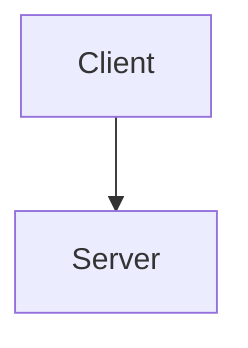
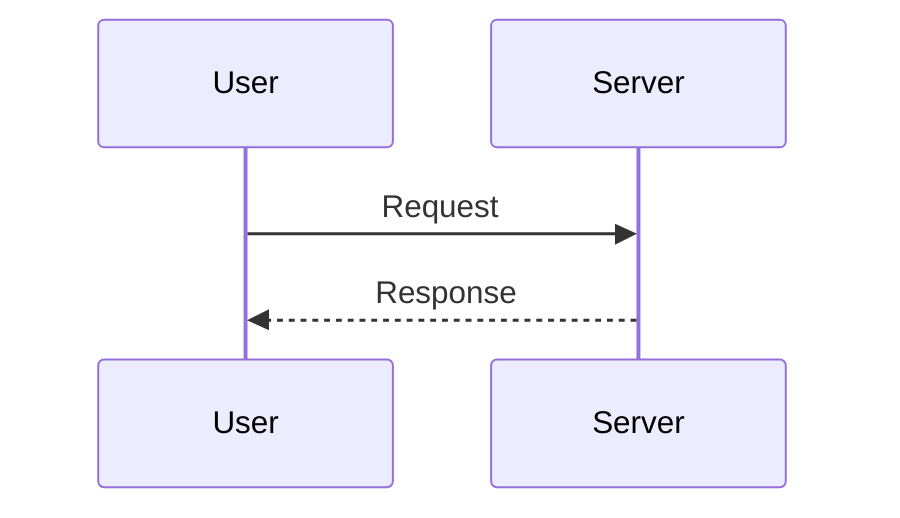
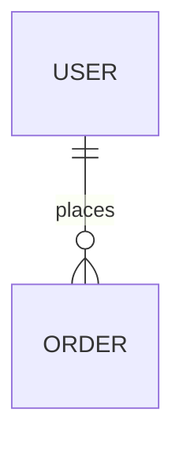

현재 프로젝트의 코드를 분석하여 기술 산출물을 생성합니다.

## 산출물 구성

### 1. 프로젝트 개요
- 프로젝트 목적 및 주요 기능
- 기술 스택
- 디렉토리 구조 (tree 형태)

### 2. 아키텍처
- 시스템 구성도 (Mermaid diagram)

- 주요 컴포넌트 간 관계
- 데이터 흐름

### 3. 주요 기능 명세
- 기능별 설명
- 시퀀스 다이어그램 (Mermaid)

### 4. 데이터 모델
- ERD 또는 데이터 구조 (Mermaid)

- 주요 타입/인터페이스 정리

### 5. API 명세 (해당 시)
- 엔드포인트 목록
- 요청/응답 형식

### 6. 설치 및 실행
- 사전 요구사항
- 설치 방법
- 실행 방법
- 환경 변수 설명

## 규칙

- 모든 다이어그램은 Mermaid 문법으로 작성
- 코드에서 파악할 수 있는 것만 작성 (추측 금지)
- 해당하지 않는 섹션은 생략
- 산출물은 마크다운 파일로 출력
