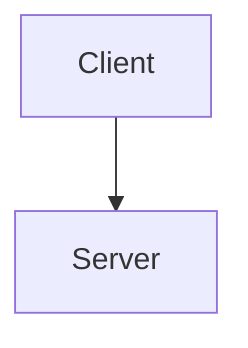
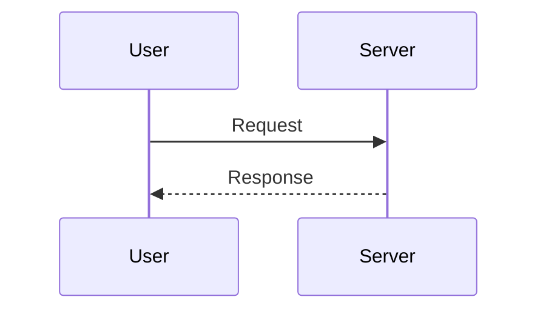
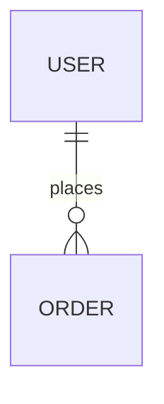

Analyze the project code and produce technical documentation.

## Sections

### 1. Overview
- Purpose and main features
- Tech stack
- Directory structure (tree)

### 2. Architecture
- System diagram (Mermaid)

- Relationships between main components
- Data flow

### 3. Feature specs
- Description per feature
- Sequence diagrams (Mermaid)

### 4. Data model
- ERD or data structures (Mermaid)

- Main types and interfaces

### 5. API spec (if applicable)
- Endpoint list
- Request and response formats

### 6. Setup and run
- Prerequisites
- Installation
- Running
- Environment variables

## Rules

- All diagrams in Mermaid
- Only what can be read from the code; no guessing
- Omit sections that do not apply
- Output as a markdown file
