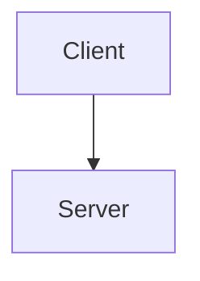
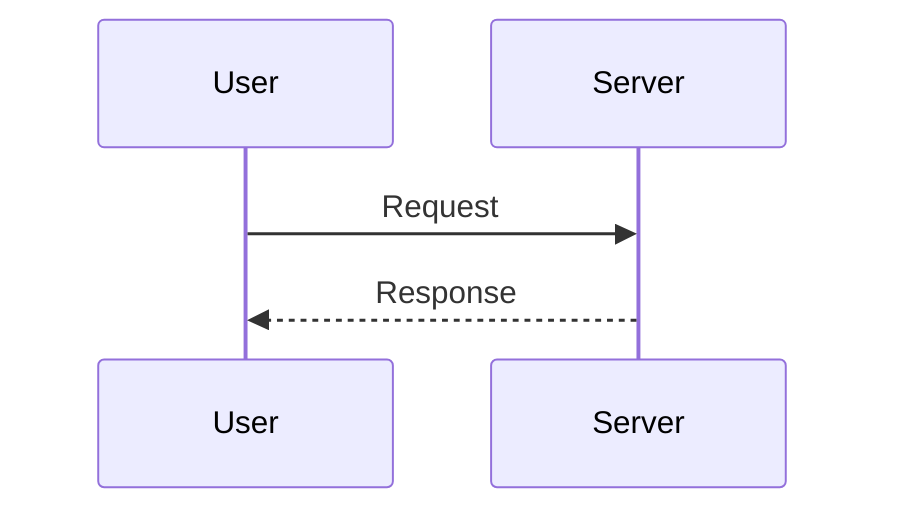
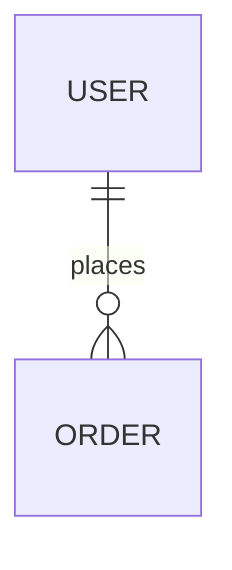

Analyze the project code and produce technical documentation.

Output: `docs/<project>-docs.md` (project = current folder name), unless the user names another path. Start the file with YAML front matter (`title`, `date`, and `author` if known) so `/pdf` can render a cover. Write in the response language.

Use `$ARGUMENTS` to narrow the scope or set the audience (handover, onboarding, submission, API only). Without it, cover every applicable section below.

## Sections

### 1. Overview
- Purpose and main features
- Tech stack
- Directory structure (tree, top two levels)

### 2. Architecture
- System diagram (Mermaid)

- Relationships between main components
- Data flow

### 3. Feature specs
- Description per feature
- Sequence diagrams (Mermaid) for the main flows

### 4. Data model
- ERD or data structures (Mermaid)

- Main types and interfaces

### 5. API spec (if applicable)
- Endpoint list
- Request and response formats

### 6. Setup and run
- Prerequisites
- Installation
- Running
- Environment variables

## Rules

- All diagrams in Mermaid
- Only what can be read from the code; no guessing. Point to files with `path:line` where useful
- Omit sections that do not apply
- Keep it readable: aim for roughly 3 to 8 pages; link to code instead of pasting large blocks
- Finish by suggesting `/pdf docs/<project>-docs.md` if the user needs a shareable file
